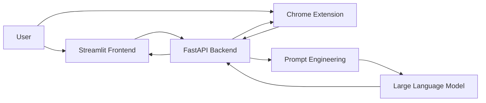

# 🤖 LinkedIn AI Assistant

> **An AI-powered assistant that helps professionals write better LinkedIn messages through intelligent reply generation, conversation summarization, and context-aware drafting.**

<p align="center">


</p>

---

## 📖 Overview

**LinkedIn AI Assistant** is a full-stack AI application designed to improve professional communication on LinkedIn.

The project combines a **FastAPI backend**, a **Streamlit web interface**, and an optional **Chrome Extension** to generate high-quality LinkedIn replies using Large Language Models (LLMs).

Unlike browser automation tools, this assistant follows a **human-in-the-loop** approach: it only drafts responses for users to review and send manually, helping maintain transparency and compliance with platform policies.

---

## ✨ Key Features

* 🤖 AI-powered LinkedIn reply generation
* 💬 Intelligent conversation summarization
* ✍️ Professional message drafting
* 🎭 Multiple writing tones (Formal, Friendly, Professional, Concise)
* 🌍 Multi-language support
* ⚡ FastAPI REST API
* 🖥 Interactive Streamlit interface
* 🧩 Optional Chrome Extension for draft insertion
* 🔒 Human-reviewed responses before sending
* 📈 Modular and scalable architecture

---

## 🏗️ System Architecture



---

## 🔄 Application Workflow

```text
User Input
      │
      ▼
Choose Writing Tone
      │
      ▼
FastAPI Backend
      │
      ▼
Prompt Engineering
      │
      ▼
Large Language Model
      │
      ▼
AI Reply Generation
      │
      ▼
User Reviews Draft
      │
      ▼
Message Sent Manually
```

---

## 🛠 Technology Stack

| Layer     | Technology            |
| --------- | --------------------- |
| Backend   | FastAPI               |
| Language  | Python                |
| Frontend  | Streamlit             |
| Extension | Chrome Extension      |
| AI        | OpenAI LLM            |
| API       | REST API              |
| Styling   | HTML, CSS, JavaScript |

---

## 📂 Project Structure

```text
linkedin-ai-assistant/

├── backend/
│   ├── main.py
│   ├── llm_client.py
│   ├── prompts.py
│   ├── requirements.txt
│   └── .env.example
│
├── frontend_streamlit/
│   ├── app.py
│   └── requirements.txt
│
├── chrome_extension/
│   ├── manifest.json
│   ├── content.js
│   ├── popup.html
│   ├── popup.js
│   └── styles.css
│
└── README.md
```

---

## 🚀 Getting Started

### Clone Repository

```bash
git clone https://github.com/sajidrehman2/linkedin-ai-assistant.git

cd linkedin-ai-assistant
```

---

## ⚙ Backend Setup

```bash
cd backend

python -m venv .venv

source .venv/bin/activate

pip install -r requirements.txt
```

Create a `.env` file.

```env
OPENAI_API_KEY=your_api_key

OPENAI_MODEL=gpt-4o-mini

PORT=8000
```

Run the backend.

```bash
uvicorn main:app --reload
```

FastAPI documentation:

```
http://localhost:8000/docs
```

---

## 🖥 Streamlit Frontend

```bash
cd frontend_streamlit

pip install -r requirements.txt

streamlit run app.py
```

---

## 🧩 Chrome Extension

1. Open Chrome Extensions.
2. Enable **Developer Mode**.
3. Click **Load unpacked**.
4. Select the `chrome_extension` folder.
5. Open LinkedIn Messaging.
6. Click **Draft with AI** to generate a suggested reply.

---

## 📌 Use Cases

* Responding to recruiters professionally
* Following up after interviews
* Networking with industry professionals
* Writing personalized connection requests
* Improving communication quality
* Saving time while maintaining authenticity

---

## 🔒 Privacy & Compliance

This project is designed with responsible AI practices in mind.

* No automatic message sending
* Human approval required before sending
* Local backend execution
* User-controlled workflow
* Intended for educational and productivity purposes

---

## 🚧 Future Improvements

* Docker support
* User authentication
* Conversation history
* Multiple LLM providers
* Prompt template library
* AI profile optimization
* Cloud deployment
* Conversation analytics

---

## 🤝 Contributing

Contributions, suggestions, and improvements are welcome.

1. Fork the repository
2. Create a feature branch
3. Commit your changes
4. Open a Pull Request

---

## 👨‍💻 Author

**Sajid Rehman**

**AI & Data Science Engineer**

* Python
* Machine Learning
* Deep Learning
* Large Language Models
* FastAPI
* Computer Vision
* NLP

GitHub: https://github.com/sajidrehman2

---

## ⭐ Support

If you found this project useful, consider giving it a **Star ⭐** on GitHub.

It helps others discover the project and supports future development.

---

## 📜 License

This project is released under the **MIT License**.

---

<p align="center">

**Building practical AI applications that solve real-world communication challenges.**

</p>
